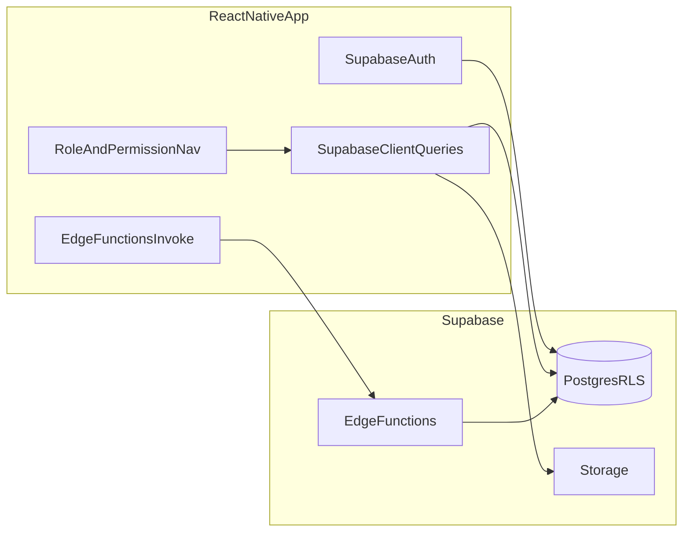

# Mobile App Specification — Control Tower (React Native)

**Purpose:** Handoff document for building a **React Native** client against the **same Supabase project** as the web app in this repository.

**Last reviewed:** 2026-04-04  
**Source repo paths:** See sections below; regenerate DB types after pulling latest migrations.

---

## 1. Executive summary

- **Backend:** Supabase (Auth, PostgreSQL with RLS, Storage, Edge Functions).
- **Mobile client must use:** `SUPABASE_URL` + **anon key** + **user session JWT** only. **Never** embed the service role key in the app.
- **Authorization model:** Not a single enum. Effective access = **`profiles.role`** (app role) + **`user_roles` / `roles` (custom role + permission array)** + **`user_permission_settings`** + **module toggles** (`module_settings`) + **feature flags** + **per-agent enablement** (`ai_agents`). Mirror the web’s [useEffectivePermissions](src/hooks/useEffectivePermissions.ts) and [AppSidebar](src/components/layout/AppSidebar.tsx) filtering.
- **Deep links:** Align path segments with web for consistency (e.g. `/loans/:id`, `/meetings/:id`).



---

## 2. Personas (mobile targets)

| Persona | Web mapping | Management scope | Notes |
|--------|-------------|------------------|--------|
| **MLO** (Mortgage Loan Officer) | `profiles.role === "user"` with custom role slug `loan_officer` (typical) or permissions via `roles.permissions` / `user_permission_settings` | `personal` — RLS limits loans/borrowers to assigned officer where applicable | Primary pipeline = “my loans”. |
| **Branch Manager** | Custom role slug `branch_manager` (see [useManagementScope.ts](src/hooks/useManagementScope.ts)) | `branch` — data scoped to `profiles.branch_id` / branch RLS | **Pipeline** shows branch-scoped manager metrics. |
| **Admin** | `profiles.role` in `admin`, `moderator` | `org` | Full admin panel `/admin/*` + all permissions if `admin` (see effective permissions). |

**Supabase helpers (RPC):** `has_role`, `is_branch_manager`, `user_branch_id`, `get_my_role` — used in RLS; mobile does not call these directly unless you add RPC wrappers for UI.

---

## 3. Authentication and session

**Web references:** [Login.tsx](src/pages/Login.tsx), [AuthContext.tsx](src/contexts/AuthContext.tsx), [Signup.tsx](src/pages/Signup.tsx).

### 3.1 Sign-in

- **Email + password:** `supabase.auth.signInWithPassword({ email, password })`.
- **Google OAuth (optional mobile phase 2):** `signInWithOAuth` — requires platform-specific redirect URLs in Supabase Auth settings.
- **Microsoft / others:** Web uses additional callbacks ([AuthCallback](src/pages/AuthCallback.tsx), [MicrosoftAuthCallback](src/pages/MicrosoftAuthCallback.tsx)); treat as phase 2 for mobile unless required.

### 3.2 Forgot password / reset via email link

- **Request reset:** `supabase.auth.resetPasswordForEmail(email, { redirectTo: '<your-app-deep-link-or-universal-link>' })`.
- **After user taps email link:** Mobile must handle the URL (Expo: `Linking`, React Navigation deep linking). Exchange code for session per Supabase Auth docs (`getSessionFromUrl` / `exchangeCodeForSession` depending on flow).
- **Update password (logged-in):** `supabase.auth.updateUser({ password })` on a “change password” screen post-login.

### 3.3 Post-login bootstrap (mirror web)

1. `supabase.auth.getSession()` / listen to `onAuthStateChange`.
2. Load **`profiles`** row for `user.id` (display name, avatar, `branch_id`, etc.).
3. Load **`user_roles`** → **`roles`** if `custom_role_id` set (slug + `permissions` JSON array).
4. Load **`user_permission_settings`** for overrides when no custom role permissions.
5. Compute **effective permission strings** in format `resource:action` (see [permissions.ts](src/lib/permissions.ts) `AVAILABLE_PERMISSIONS`).
6. Load **`module_settings`** for gates like `loans`, `pricing_lock`.
7. Optionally load **`feature_flags`** (if used in your deployment) and **`ai_agents`** rows for agent slugs used in nav.

---

## 4. Navigation and module matrix (vs web)

**Sidebar source:** [AppSidebar.tsx](src/components/layout/AppSidebar.tsx) (`navigationItems`, `aiToolsItems`, `filterItems`).  
**Routes source:** [App.tsx](src/App.tsx).  
**Admin path permissions:** [admin-routes.ts](src/lib/admin-routes.ts).

Legend: **Y** = show if gates pass, **—** = hidden or N/A, **Gates** = permission + module + feature flag + agent as listed.

| Module | Web route(s) | Gates (summary) | MLO | Branch Mgr | Admin |
|--------|--------------|-----------------|-----|------------|-------|
| Dashboard | `/dashboard` | Authenticated | Y | Y | Y |
| Clients | `/clients`, CRUD | `clients:read` + `enableClients` | Y* | Y* | Y* |
| Meetings | `/meetings` | `meetings:read` + `enableMeetings` | Y* | Y* | Y* |
| Knowledge | `/knowledge` | `knowledge:read` + `enableKnowledgeBase` | Y* | Y* | Y* |
| Borrowers | `/borrowers` | `borrowers:read` + module `loans` | Y* | Y* | Y* |
| Loans | `/loans`, detail, edit | `loans:read` + module `loans` | Y* | Y* | Y* |
| Loan import | `/loans/import` | `loans:import` + module `loans` | Y* | Y* | Y* |
| Document generation | `/document-generation` | `loans:read` + module `loans` + document-generation agent enabled | Y* | Y* | Y* |
| Pricing & rate lock | `/pricing/*` | module `pricing_lock` + `pricing:read` etc. | Y* | Y* | Y* |
| **Pipeline** | `/pipeline` | **`useManagementScope.showInNav`** — true when `scope !== "none"` (**personal**, **branch**, **org**) — see [useManagementScope.ts](src/hooks/useManagementScope.ts) | Y | Y | Y |
| Action items | `/action-items` | Action-items agent enabled in `ai_agents` | Y* | Y* | Y* |
| AI Agents browse | `/agents` | Authenticated | Y | Y | Y |
| AI Chat | `/ai`, `/ai/chat` | **Route guard:** wrapped in **`AdminRoute`** — only **`admin`** / **`moderator`** app role + `enableAIChat` | —** | —** | Y |
| Feedback | `/feedback` | `enableFeedback` | Y | Y | Y |
| Profile / Settings | `/profile`, `/settings` | Authenticated | Y | Y | Y |
| Notifications | `/notifications` | `enableNotifications` | Y* | Y* | Y* |
| Admin panel | `/admin/*` | `AdminRoute` + per-path permission ([admin-routes.ts](src/lib/admin-routes.ts)) | — | — | Y*** |

\* **Y** only if that persona’s role/permissions + module + flags satisfy the gate.  
\*\* **As built in web:** AI Chat routes sit under [AdminRoute](src/components/auth/AdminRoute.tsx); **loan officers do not reach `/ai` even if the sidebar item appears** — confirm product intent; mobile may either match this or use permission-based routing instead.  
\*\*\* Moderators also have admin panel access where `AdminRoute` allows.

**Pipeline note:** Sidebar shows `/pipeline` when `showInNav` is true (`scope` is `personal`, `branch`, or `org`). **MLOs** (`personal`) see the nav item; dashboard metrics are still **RLS-scoped** (personal pipeline view vs branch vs org). The nav item comment in [AppSidebar.tsx](src/components/layout/AppSidebar.tsx) says “manager-level” but the code uses `showInNav` from scope, which includes `personal`.

---

## 5. Feature specs (mobile parity targets)

### 5.1 Dashboard (`/dashboard`)

- **Hooks:** [useDashboard.ts](src/hooks/useDashboard.ts) — `useDashboardStats`, `useRecentActivity`.
- **Stats cards:** Clients (total, this month), meetings (total, upcoming), knowledge (published total, recent week), AI agents (placeholders in hook — extend if `ai_agents` / `ai_agent_runs` wired).
- **Quick actions:** Links to add client, meeting, knowledge, agents (see [Dashboard.tsx](src/pages/Dashboard.tsx)).
- **Recent activity:** Aggregated list (clients, meetings, knowledge, AI) from hook.
- **My Performance (gamification):** [MyPerformanceCard](src/components/leaderboard/MyPerformanceCard.tsx) — `leaderboard_scores`, `officer_badges`, `badge_definitions` (weekly/monthly toggle).

### 5.2 Manager / Pipeline dashboard (`/pipeline`)

- **Page:** [ManagerDashboard.tsx](src/pages/ManagerDashboard.tsx).
- **Audience:** Any user with `showInNav` (personal / branch / org). **Content** is driven by hooks + RLS: MLOs see a **personal** slice; branch managers **branch**; admins **org**. Some widgets (e.g. branch coaching digest, team leaderboard refresh) are role/agent-gated in the component.
- **Features:** KPI cards (active loans, at-risk, lock expiring, on-time rate), lock alerts, top priority loans (pipeline agent), rate alerts, branch coaching digest (agent), **team leaderboard** ([LeaderboardWidget](src/components/leaderboard/LeaderboardWidget.tsx)), pipeline funnel, bottlenecks, risk-by-officer table, exports, optional AI portfolio summary ([generate-pipeline-summary](supabase/functions/generate-pipeline-summary/index.ts)).

### 5.3 Loans module

- **List/detail:** [useLoans.ts](src/hooks/useLoans.ts), [LoanDetail.tsx](src/pages/LoanDetail.tsx).
- **RLS:** Drives which loans appear per user (officer assignment, branch, admin).
- **Sub-features (prioritize for mobile phases):**
  - **P0:** List, search/filter, detail header, key fields, link to borrower.
  - **P1:** Conditions, milestones, timeline, risk badge, SLA card.
  - **P2:** Loan coaching agent, communication timeline, underwriting pre-check, rate alert, compliance, borrower portal invite, portal messages/disclosures (DocuSign).
- **Import:** CSV via [import-loans-csv](supabase/functions/import-loans-csv/index.ts) with `loans:import`.

### 5.4 Borrowers

- CRUD under `/borrowers` — same `loans` module gate + `borrowers:*` permissions.

### 5.5 Clients

- CRUD under `/clients` — `clients:*` permissions.

### 5.6 Meetings

- **Table:** `meetings` — status lifecycle `scheduled` / `completed` / `cancelled` (see migrations).
- **Web behavior:** Admin-oriented create/status changes in parts of UI; all authenticated may read per RLS — confirm [Meetings.tsx](src/pages/Meetings.tsx) / [MeetingDetail](src/pages/MeetingDetail.tsx) for exact rules.

### 5.7 Knowledge base

- **Tables:** `knowledge_entries`, `knowledge_categories`, files/storage as used by web.
- **Routes:** Library list, category, detail, upload, personal knowledge.

### 5.8 Action items

- **Table:** `action_items` — [useActionItems.ts](src/hooks/useActionItems.ts).
- **Gate:** Agent slug for action items enabled in `ai_agents` (see `ACTION_ITEMS_AGENT_SLUG` in [useAgentEnabled.ts](src/hooks/useAgentEnabled.ts)).

### 5.9 Document generation / communications

- **Route:** `/document-generation` → [CommunicationCenter](src/pages/CommunicationCenter.tsx).
- **Gate:** Document generation agent + `loans:read` + `loans` module.

### 5.10 AI Chat

- **Edge:** [ai-chat-assistant](supabase/functions/ai-chat-assistant/index.ts) (and related).
- **Web routing caveat:** Currently under `AdminRoute` — see matrix above.

### 5.11 Feedback

- **Table:** `feedback` — [Feedback.tsx](src/pages/Feedback.tsx).

### 5.12 Notifications

- **Table:** `notifications` — bell / list pattern in web.

### 5.13 Admin panel (mobile optional)

- Large surface: users, roles, settings, integrations, modules, SLA, cron jobs, compliance rules, knowledge admin, etc. Map each screen to [admin-routes.ts](src/lib/admin-routes.ts) permission keys.

---

## 6. Data models and Supabase schema

### 6.1 Canonical types

Regenerate from the linked Supabase project after every migration pull:

```bash
npx supabase gen types typescript --project-id <id> > src/integrations/supabase/types.ts
```

**Reference snapshot in repo:** [src/integrations/supabase/types.ts](src/integrations/supabase/types.ts).

> **Note:** Generated `types.ts` may lag newer migrations (e.g. `pipeline_priority_scores`, `compliance_*`, `leaderboard_scores`, `badge_definitions`, `officer_badges`, `loan_disclosures`, `portal_messages`). Always reconcile with `supabase/migrations/*.sql`.

### 6.2 Table index (public schema — core)

| Table | Purpose |
|-------|---------|
| `profiles` | User profile, `branch_id`, names, avatar, email |
| `user_roles` | `role` (app_role enum), `custom_role_id` |
| `roles` | Custom role slug, `permissions` JSON array |
| `user_permission_settings` | Per-user permission overrides |
| `module_settings` | Feature module on/off (`loans`, `pricing_lock`, …) |
| `clients` | CRM clients |
| `borrowers` | Borrower records; FK to loans |
| `loans` | Loan pipeline; `loan_officer_id`, `branch_id`, `status`, amounts |
| `loan_conditions` | Conditions; assignment, due dates |
| `loan_milestones` | Milestone tracker |
| `loan_timeline_events` | Audit-style timeline |
| `loan_risk_scores` | Risk level per loan |
| `loan_risk_alerts` | Risk alerts |
| `loan_borrower_uploads` | Portal uploads |
| `borrower_portal_invites` | Portal magic links |
| `borrower_communications` | Borrower comms agent |
| `meetings` | Meetings |
| `zoom_files` | Zoom recording metadata |
| `knowledge_entries` | Knowledge docs |
| `knowledge_categories` | Categories |
| `action_items` | Tasks / action items |
| `tasks`, `task_comments` | Legacy/alternate task tables |
| `notifications` | In-app notifications |
| `feedback` | User feedback |
| `ai_agents`, `ai_agent_runs`, `ai_chat_threads` | AI configuration and chat |
| `branches` | Branch master |
| `loan_products`, `loan_programs` | Product/program catalogs |
| `rate_sheets`, `rate_sheet_products`, `rate_sheet_datastores` | Pricing |
| `rate_locks`, `rate_lock_history`, `lock_alerts` | Locks |
| `loan_pricing_calculations` | Pricing calc history |
| `product_eligibility_rules` | Eligibility |
| `sla_configurations` | SLA |
| `integration_settings` | Integration Hub secrets metadata |
| `activity_logs` | Activity |
| `edge_functions` | Invocation tracking |
| `badge_definitions`, `officer_badges`, `leaderboard_scores` | Gamification (migrations) |
| Views: `activity_logs_with_users`, `admin_statistics` | Reporting |

**Additional tables** may exist only in migrations until types are regenerated (e.g. compliance screenings, pipeline priority scores, cron wrappers).

### 6.3 RLS (conceptual)

All of the above are protected by RLS. Mobile relies on **user JWT**; queries return only rows the policy allows. Do not duplicate authorization in client-only checks except for UX (hiding nav).

---

## 7. API patterns

### 7.1 Supabase client

```ts
import { createClient } from '@supabase/supabase-js';
const supabase = createClient(EXPO_PUBLIC_SUPABASE_URL, EXPO_PUBLIC_SUPABASE_ANON_KEY);
// After sign-in, session is attached automatically for requests.
```

### 7.2 Edge Functions

**Invoke:**

```ts
const { data, error } = await supabase.functions.invoke('function-name', {
  body: { /* JSON */ },
});
```

**Important:** Many functions have **`verify_jwt = false`** in [supabase/config.toml](supabase/config.toml) but **validate the user inside the function** with `Authorization: Bearer <user_jwt>` and service role for DB. Always send the **user’s access token** unless the function is explicitly public (e.g. portal invite redeem).

### 7.3 Edge function inventory

| Function | verify_jwt (gateway) | Typical caller | Notes |
|----------|----------------------|----------------|-------|
| `validate-api-key` | false | Admin | Integration key test |
| `los-sync-lendingpad` | false | Admin | LOS sync |
| `sync-data-feed` | false | Admin | Data feeds |
| `admin-reset-user-password` | false | Admin | Password reset |
| `file-risk-agent` | false | Staff | Loan file risk |
| `generate-daily-actions` | false | System/cron | Daily actions |
| `generate-borrower-update` | false | Staff | Document generation |
| `approve-borrower-communication` | false | Staff | Comms approval |
| `generate-pipeline-summary` | false | Manager | AI summary |
| `import-loans-csv` | false | Staff | CSV import |
| `portal-create-invite` | false | Staff | Portal invite |
| `portal-redeem-invite` | false | Borrower | Public portal |
| `portal-loan-summary` | false | Borrower | Portal JWT |
| `portal-submit-upload` | false | Borrower | Portal upload |
| `portal-staff-upload-url` | false | Staff | Signed URL |
| `portal-send-message` | false | Borrower | Portal message |
| `sync-zoom-files` | false | Admin | Zoom |
| `zoom-disconnect` | false | Admin | Zoom |
| `send-notification` | false | System | Notifications |
| `send-feedback-notification` | false | System | Feedback email |
| `loan-coaching-agent` | false | Staff | Coaching chat |
| `send-borrower-email` | false | System | SendGrid |
| `auto-draft-milestone-comm` | false | System | Milestone drafts |
| `underwriter-precheck-agent` | false | Staff | Pre-check |
| `pipeline-prioritization-agent` | false | Cron/manager | Priority scores |
| `admin-cronjobs` | false | Admin | Cron UI |
| `rate-alert-intelligence-agent` | false | Cron/staff | Rate alerts |
| `compliance-screening-agent` | false | Staff | Compliance |
| `import-compliance-rules` | false | Admin | Rules JSON |
| `branch-performance-coach-agent` | false | Manager | Coaching digest |
| `condition-workflow-engine` | false | System | Conditions workflow |
| `docusign-send-envelope` | false | Staff | E-sign |
| `docusign-webhook` | false | DocuSign | Webhook |
| `compute-leaderboard` | false | Manager | Leaderboard |
| `ai-chat-assistant` | (see config if listed) | Staff | AI chat |
| `calculate-loan-risk` | (see config) | System/staff | Risk calc |
| `pricing-calculate`, `pricing-datastores`, `pricing-rate-sheets-upload`, `rate-locks` | (see config) | Staff | Pricing |
| `lendingpad-oauth-*` | (see config) | Admin | LendingPad OAuth |

*If a function is not listed in `config.toml`, check `supabase/functions/` — gateway may default JWT verification on cloud.*

### 7.4 Storage

Use Supabase Storage APIs for knowledge uploads and any bucket referenced in web hooks (bucket names in migrations / app config).

### 7.5 Realtime

Optional for v1. Web may subscribe to select tables (e.g. chat usage) — grep `channel(` / `realtime` in `src/` if needed.

---

## 8. Mobile environment and configuration

| Variable | Use |
|----------|-----|
| `EXPO_PUBLIC_SUPABASE_URL` | Project URL |
| `EXPO_PUBLIC_SUPABASE_ANON_KEY` | Anon key |

**Password recovery:** Add mobile redirect URLs in Supabase Dashboard → Authentication → URL configuration.

**Feature flags / modules:** If mobile cannot query `feature_flags` / `module_settings` the same way as web, ship a minimal config or fetch on startup via RLS-permitted read.

---

## 9. Borrower portal (out of scope for staff mobile)

Routes `/portal/*` use a **separate portal JWT** (not Supabase Auth session for staff). If you build a **borrower** app, see [borrowerPortalApi.ts](src/lib/borrowerPortalApi.ts) and portal edge functions.

---

## 10. File reference index (web)

| Area | Path |
|------|------|
| Routes | [src/App.tsx](src/App.tsx) |
| Main nav | [src/components/layout/AppSidebar.tsx](src/components/layout/AppSidebar.tsx) |
| Admin nav | [src/components/layout/AdminSidebar.tsx](src/components/layout/AdminSidebar.tsx) |
| Permissions defs | [src/lib/permissions.ts](src/lib/permissions.ts) |
| Effective permissions | [src/hooks/useEffectivePermissions.ts](src/hooks/useEffectivePermissions.ts) |
| Management scope | [src/hooks/useManagementScope.ts](src/hooks/useManagementScope.ts) |
| Admin path → permission | [src/lib/admin-routes.ts](src/lib/admin-routes.ts) |
| DB types | [src/integrations/supabase/types.ts](src/integrations/supabase/types.ts) |
| Migrations | [supabase/migrations/](supabase/migrations/) |
| Edge functions | [supabase/functions/](supabase/functions/) |
| Gateway JWT flags | [supabase/config.toml](supabase/config.toml) |

---

*End of specification.*
