# SJ Dashboard Framework - Visual Architecture

> **Visual diagrams** showing the framework structure, data flow, and component relationships.

---

## 🏗️ High-Level Architecture

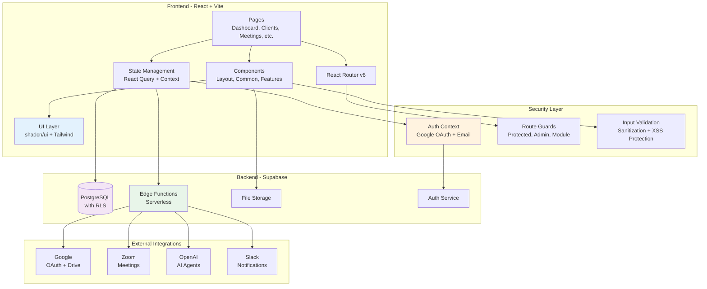

---

## 📦 Framework Layers

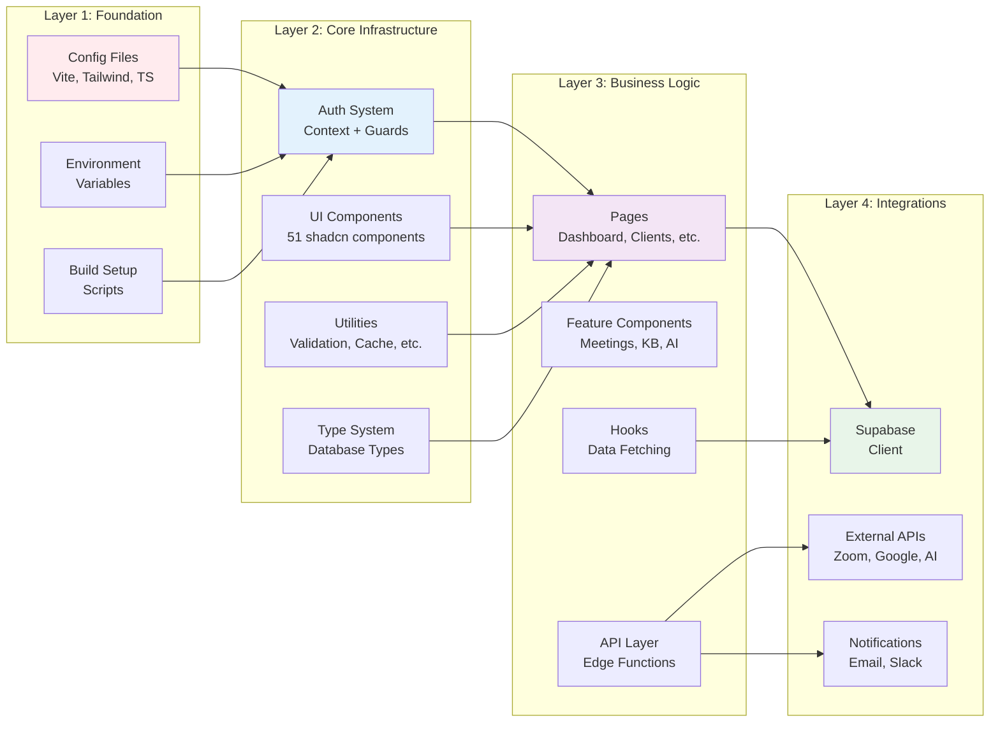

---

## 🔐 Authentication & Authorization Flow

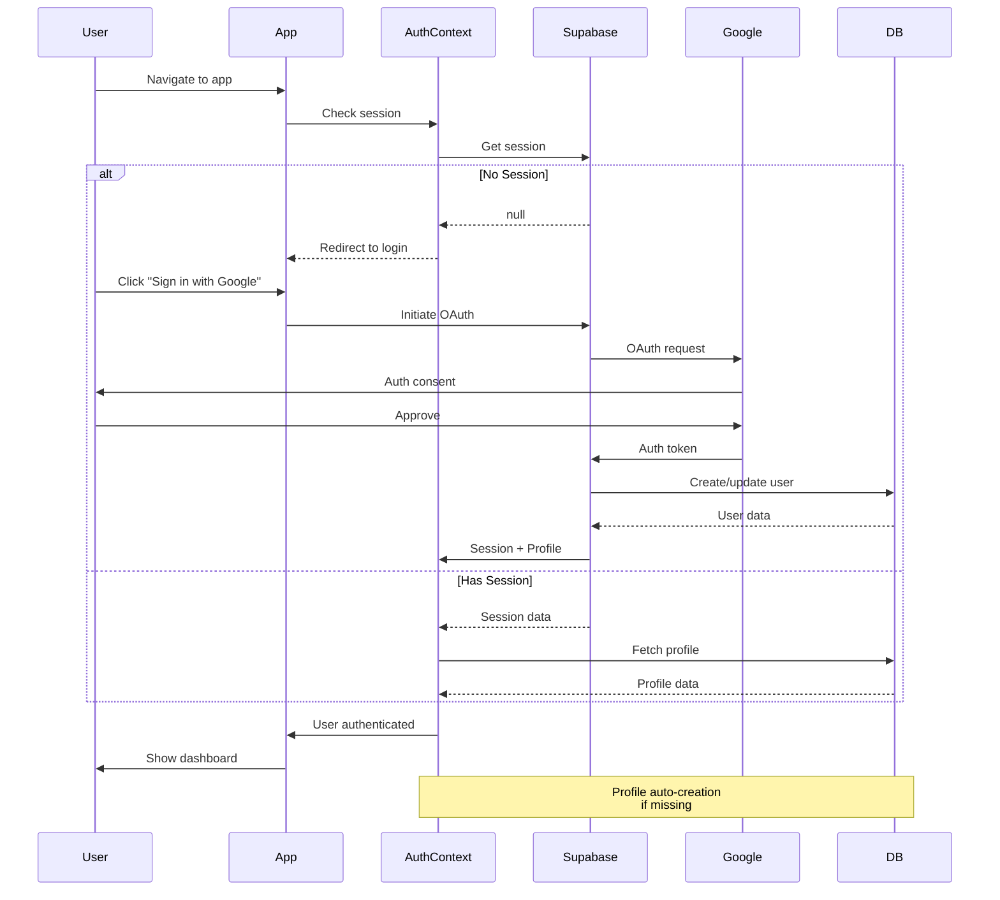

---

## 🛡️ Route Protection System

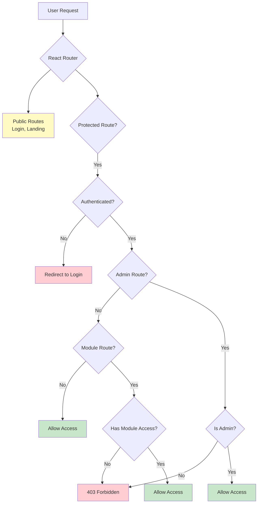

---

## 📊 Data Flow Architecture

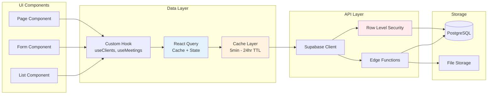

---

## 🎨 Component Hierarchy

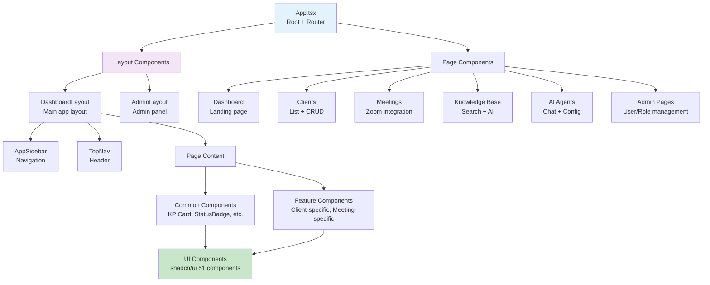

---

## 🔄 State Management Pattern

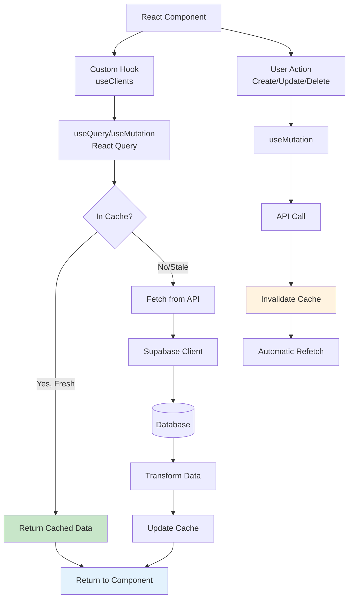

---

## 🧩 Feature Module Structure

### **Example: Clients Module**

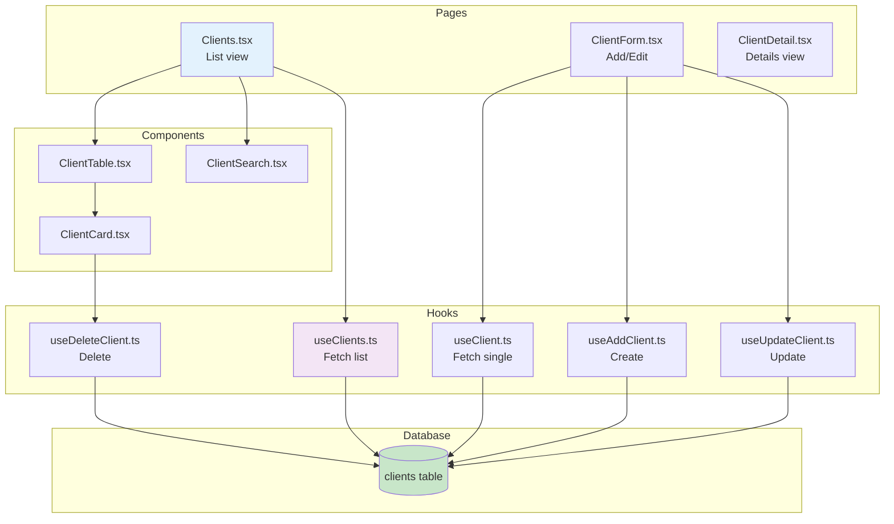

---

## 🤖 AI Framework Architecture

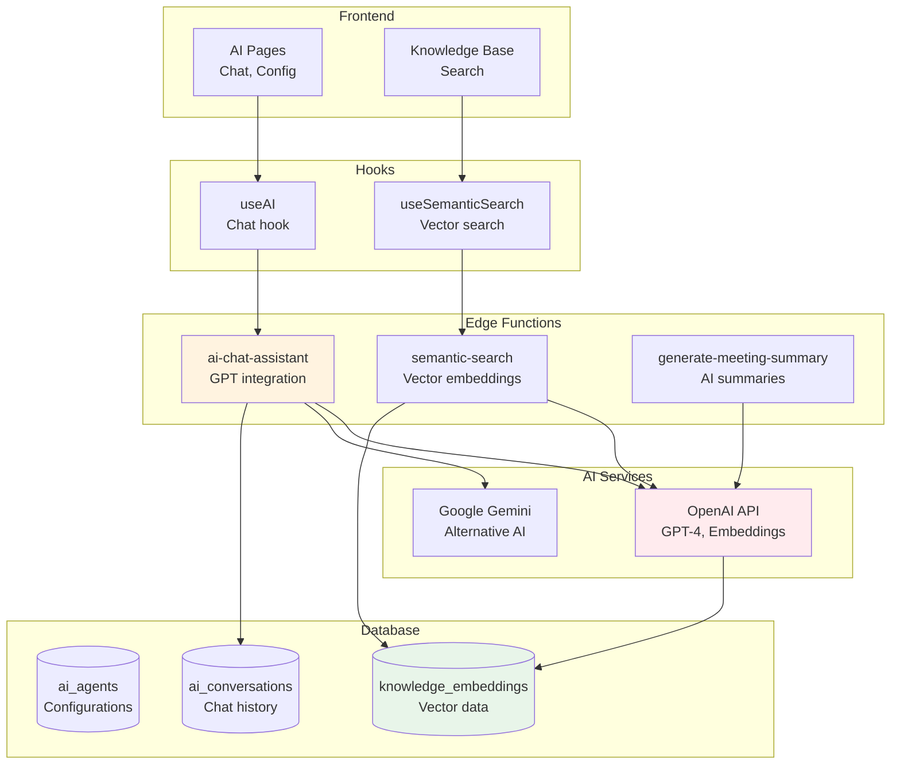

---

## 📁 Directory Structure Visual

```
sj-dashboard-framework/
│
├── 📋 Configuration (Root)
│   ├── package.json              # Dependencies
│   ├── vite.config.ts            # Build config
│   ├── tailwind.config.ts        # Theming
│   └── tsconfig.*.json           # TypeScript
│
├── 📂 public/                    # Static assets
│   ├── logo.svg
│   └── placeholder.svg
│
├── 📂 src/
│   │
│   ├── 🎯 Entry Points
│   │   ├── main.tsx              # React entry
│   │   ├── App.tsx               # Root component
│   │   └── index.css             # Global styles
│   │
│   ├── ⚙️ Configuration
│   │   ├── config/
│   │   │   └── api.ts            # API endpoints
│   │   └── constants/
│   │       └── routes.ts         # Route constants
│   │
│   ├── 📘 Types
│   │   ├── database.ts           # Supabase types
│   │   └── edge-functions.ts    # Function types
│   │
│   ├── 🔐 Auth & Security
│   │   ├── contexts/
│   │   │   └── AuthContext.tsx
│   │   ├── components/auth/
│   │   │   ├── ProtectedRoute.tsx
│   │   │   ├── AdminRoute.tsx
│   │   │   └── ModuleRoute.tsx
│   │   └── lib/
│   │       ├── sanitize.ts       # XSS protection
│   │       └── validation.ts     # Input validation
│   │
│   ├── 🎨 UI Components
│   │   └── components/
│   │       ├── ui/               # 51 shadcn components
│   │       ├── common/           # Reusable components
│   │       └── layout/           # Layouts
│   │
│   ├── 📄 Pages
│   │   └── pages/
│   │       ├── Dashboard.tsx
│   │       ├── Clients.tsx
│   │       ├── meetings/
│   │       ├── knowledge/
│   │       ├── ai/
│   │       └── admin/
│   │
│   ├── 🪝 Hooks
│   │   └── hooks/
│   │       ├── useClients.ts
│   │       ├── useMeetings.ts
│   │       ├── useKnowledge.ts
│   │       └── useAI.ts
│   │
│   └── 🛠️ Utilities
│       └── lib/
│           ├── utils.ts          # Core utilities
│           ├── cache.ts          # Caching system
│           ├── exportUtils.ts    # PDF/CSV export
│           └── edge-functions.ts # Function wrapper
│
└── 📂 supabase/
    ├── config.toml               # Supabase config
    ├── migrations/               # Database migrations
    └── functions/                # Edge functions
        ├── ai-chat-assistant/
        ├── semantic-search/
        ├── sync-zoom-files/
        └── send-notification/
```

---

## 🔄 Development Workflow

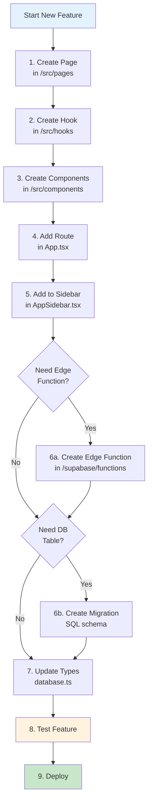

---

## 🚀 Deployment Architecture

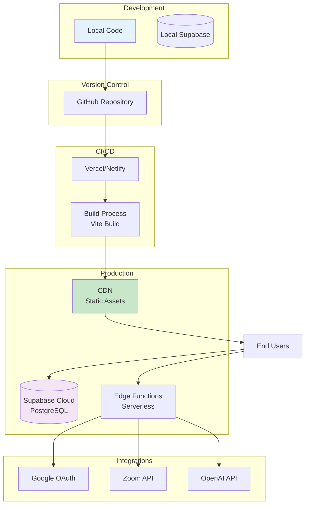

---

## 📊 Database Schema (V1 Tables)

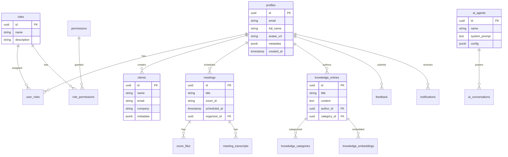

---

## 🎯 Framework Tiers

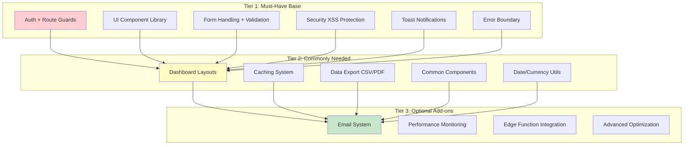

---

## 💡 Key Design Patterns

### **1. Cache-Aside Pattern**
```
Component → Check Cache → Hit? Return : Fetch → Update Cache → Return
```

### **2. Query Key Factory**
```typescript
permissionKeys = {
  all: ['permissions'],
  list: () => ['permissions', 'list'],
  detail: (id) => ['permissions', id]
}
```

### **3. Protected Route Pattern**
```
Request → ProtectedRoute → Auth Check → Allow/Deny
```

### **4. Edge Function Wrapper**
```
Hook → invokeEdgeFunction() → JWT Forward → Function → Response
```

---

## 📈 Scalability Considerations

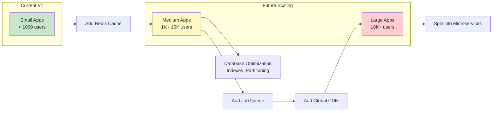

---

## 🎨 Theming System

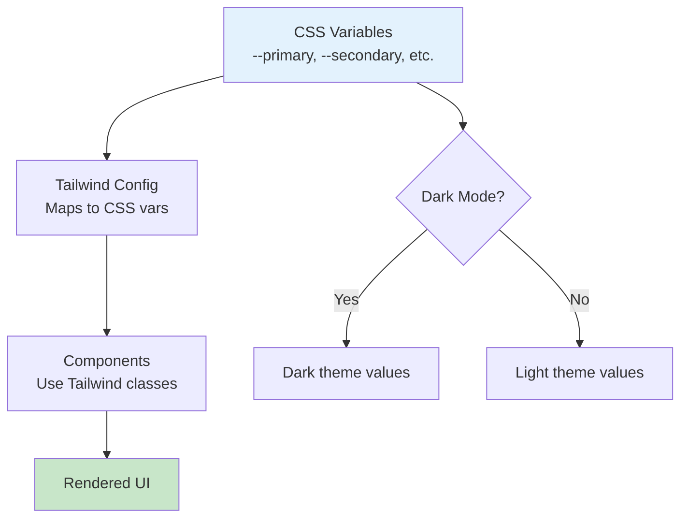

---

## ✅ Summary

This framework provides:

- ✅ **Modular Architecture** - Easy to add/remove features
- ✅ **Type Safety** - Full TypeScript support
- ✅ **Scalable** - From small apps to enterprise
- ✅ **Secure** - Auth, RLS, XSS protection
- ✅ **Performant** - Caching, optimization, lazy loading
- ✅ **Developer-Friendly** - Clear patterns, documentation

**Use these diagrams to:**
1. Understand the architecture before customizing
2. Explain structure to team members
3. Plan new features
4. Troubleshoot issues

---

For implementation details, see:
- `SJ-DASHBOARD-FRAMEWORK_EXTRACTION_GUIDE.md`
- `SJ-DASHBOARD-FRAMEWORK_SETUP.md`
- `SJ-DASHBOARD-FRAMEWORK_CLEANUP_CHECKLIST.md`
